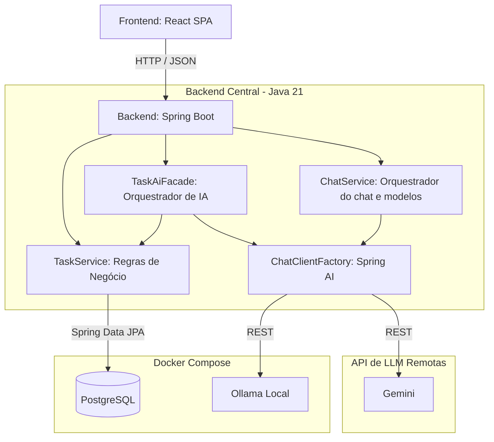

# AI Task Manager - Desafio Técnico

## Descrição do Sistema
O AI Task Manager é uma aplicação web Full Stack para gerenciamento visual de tarefas diárias. Ele permite a criação de tarefas, gestão de subtarefas em hierarquia e organização em formato Kanban. O grande diferencial é a profunda integração com Inteligência Artificial para analisar contexto, melhorar descrições, decompor épicos complexos em etapas menores e interagir com o usuário por meio de um assistente virtual contextual.

## Arquitetura e Serviços
O projeto foi estruturado seguindo uma arquitetura moderna e desacoplada, separando a responsabilidade de apresentação, regra de negócio e processamento de IA.



* **Frontend (React SPA):** Interface rica consumida diretamente do navegador, responsável pela interação drag-and-drop e pelas chamadas rest. Servida otimizada por um Nginx Alpine.
* **Backend (Spring Boot):** Monolito central de regras de negócio, atuando também como "cérebro validador" que garante que os dados vindos da inteligência artificial estão estruturalmente corretos e condizentes antes de salvá-los no banco.
* **Database (PostgreSQL):** Serviço responsável por garantir a integridade relacional, suporte a tarefas encadeadas e o status lógico dos registros.
* **Ollama (LLM Provider):** Container responsável pelo processamento de rede neural (modelos de linguagem local) para atender de forma segura aos *prompts* do sistema.

## Tecnologias Utilizadas
**Backend:**
- Java 21
- Spring Boot 4.1.1 (Spring Web, Spring Data JPA, Spring Validation)
- Spring AI 2.0.1
- Flyway (Database Migrations)
- Swagger / OpenAPI
- JUnit, Mockito e AssertJ (Testes unitários e integração automatizados)

**Frontend:**
- React 19 (criado com Vite)
- Tailwind CSS v4 (Suporte Light/Dark Mode)
- Axios
- Native React Hooks

**Infraestrutura e IA:**
- Banco de dados relacional: PostgreSQL
- Provedor de LLM: Ollama local (com suporte a Gemini opcional)
- Containerização: Docker e Docker Compose (Multi-stage builds)

## Pré-requisitos
Para executar este projeto sem precisar configurar Java ou Node.js localmente, você necessitará apenas de:
- [Docker](https://docs.docker.com/get-docker/)
- [Docker Compose](https://docs.docker.com/compose/install/)

## Instruções de Execução

1. Certifique-se de que não existem outros processos (como bancos postgres) utilizando as portas `5432`, `8080`, `11434` ou `80` em sua máquina.
2. Navegue pelo terminal até o diretório raiz do projeto:
```bash
cd ai-task-manager
```
3. Suba todo o ambiente usando o Docker Compose:
```bash
docker compose up -d --build
```
4. Faça a instalação do seu modelo local:
```bash
docker compose exec -it ollama ollama pull <NOME_DO_MODELO>
```
*(Na primeira vez que for executado, o Docker fará o download das imagens do PostgreSQL e Ollama, além de realizar o build de cada aplicação Spring e React, o que pode levar alguns minutos).*

4. Acessos aos serviços em execução:
- **Frontend (Interface do Usuário):** http://localhost
- **Backend (API Base):** http://localhost:8080
- **Documentação Swagger:** http://localhost:8080/swagger-ui.html

## Principais Endpoints

**Tarefas (`/tasks`)**
- `GET /tasks` - Busca e listagem de tarefas com paginação.
- `POST /tasks` - Criação de nova tarefa (Status inicial TODO).
- `PATCH /tasks/{id}/status` - Atualiza o status da tarefa (ex: para `IN_PROGRESS`).
- `PATCH /tasks/{id}/parent` - Modifica a hierarquia associando a uma tarefa pai.
- `DELETE /tasks/{id}` - Exclui a tarefa de forma lógica (Soft Delete).

**Inteligência Artificial (`/ai/tasks` e `/chat`)**
- `POST /ai/tasks/{id}/enhance` - Melhora título e descrição de uma tarefa existente.
- `POST /ai/tasks/{id}/analyze` - Analisa tecnicamente a tarefa para deduzir prioridades.
- `POST /ai/tasks/{id}/decompose` - Decompõe e cria automaticamente subtarefas baseadas em uma tarefa pai.
- `POST /chat` - Conversação interativa livre com o assistente mantendo a memória associada à sessão (`chatId`).

## Funcionalidades de Inteligência Artificial
O sistema aplica estratégias avançadas para integração com LLMs (Modelos de Linguagem):
- **Structured Outputs e Validação:** Utilizando o `.entity(Class)` do Spring AI, o modelo é forçado a retornar um JSON rigorosamente estruturado (ex: `TaskDecomposeResponseDTO`). Após o parsing, o Jakarta `Validator` é acionado de forma síncrona para confirmar regras sintáticas, arremessando um `AiResponseValidationException` caso a IA tenha alucinado, impedindo que falhas atinjam a camada de persistência.
- **Tool Calling (Function Calling):** O assistente de Chat possui anotações `@Tool` que permitem à própria IA acionar funções back-end, como "pesquisar tarefas" ou "contar chamados em andamento" de forma autônoma para construir as respostas.
- **Memória de Chat:** O endpoint de bate-papo rastreia conversas de longo prazo com o `MessageChatMemoryAdvisor`, isolando o contexto entre interações de forma *non-blocking*.

## Estratégia de Persistência
- Utilizou-se um container central do **PostgreSQL** atualizado de forma automatizada por **Flyway Migrations**.
- O modelo relacional suporta um autorelacionamento (Foreign Key `parent_task_id`), permitindo níveis aninhados de gestão hierárquica de subtarefas.
- Exclusão lógica (`Soft Delete`): Ao deletar uma tarefa no frontend, a API do backend apenas converte a flag `deleted = true`. O Hibernate está configurado com a anotação `@SQLRestriction("deleted = false")` no nível da entidade para omitir tarefas excluídas de consultas automaticamente, sem perda de dados históricos.

## Principais decisões arquiteturais
- **Design Pattern Facade:** Para orquestrar o funcionamento da lógica de tarefas (CRUD) em conjunto com a Inteligência Artificial, foi implementado o Design Pattern *Facade* (`TaskAiFacade`). Esta fachada atua de forma coordenada entre os serviços (`TaskService` e a `ChatClientFactory`), entregando aos Controllers uma abstração limpa de todo o fluxo.
- **Design Pattern Strategy:** Para permitir que fosse alternado em tempo de execução o provedor do modelo de Inteligência Artifical, foi implementado o Design Pattern *Strategy*(`ChatClientStrategy`). Ele atua como uma abstração para o `ChatClientFactory`, que atua como orquestrador desses modelos, permitindo que ao `ChatService` e ao `TaskAiFacade` acessar qualquer modelo de Inteligência Artificial configurado na aplicação de forma dinâmica. O `AiProviderService` atua como o gerenciador do modelo que o usuário quer utilizar e repassar essa informação ao `ChatClientFactory`. 
- **Externalização de Prompts:** Os templates textuais de instrução do modelo de IA foram completamente abstraídos do código-fonte Java para arquivos isolados `.st` (String Templates) dentro da pasta *resources*, facilitando o ajuste fino do LLM sem necessidade de recompilar a aplicação.
- **Validação Rica no Domínio:** A classe de entidade `Task.java` possui *guardrails* nativos de negócio (como impossibilidade de voltar um status de DONE para TODO, e validação contra vínculos parentais circulares). Evidencia-se a decisão de que a IA deve ser submissa às travas de segurança do Sistema Central, e nunca o inverso.
- **Frontend sem Gerenciadores de Estado Globais:** Para diminuir a complexidade do cliente React, a aplicação abdica intencionalmente do uso de Redux ou Zustand. Todo compartilhamento de informações para a atualização do board Kanban e dos cartões acontece eficientemente pelo React via Prop Drilling e Native Hooks (`useState` e `useEffect`).
- **Otimização Multi-stage no Docker:** Tanto o React quanto o Spring Boot utilizam a estratégia multi-stage build. Dependências pesadas como Maven e NPM só coexistem no estágio `build`. O container final de produção é executado em instâncias limpas (Nginx Alpine e JRE Eclipse Temurin), resultando em aplicações mais leves, seguras e portáteis.
- **Autonomia da IA via Tool Calling:** Para prover contexto rico e em tempo real à IA, optou-se pela utilização do padrão de *Function/Tool Calling* fornecido pelo Spring AI. Com anotações `@Tool`, a IA consegue decidir ativamente consultar a base de dados (ex: "pesquisar tarefas") em vez de depender de grandes fluxos de injeção de contexto (RAG estático), tornando a interação mais dinâmica e precisa.
- **Memória de Chat em Memória Temporária (RAM):** O histórico de conversação do assistente virtual foi implementado propositalmente utilizando o `InMemoryChatMemory`. Foi decidido que não fazia sentido onerar o banco de dados principal com o armazenamento persistente de logs de bate-papos livres. O histórico dura exatamente enquanto a sessão/aba estiver ativa, isolado por um `chatId` gerenciado pela camada web.